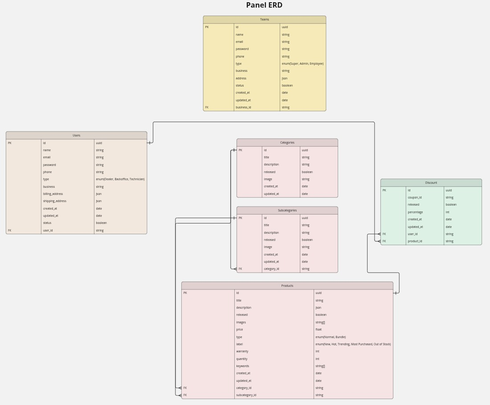

## Requirements

- Users: Support Team, Business Owners, Business Customers
- App Features:
  * Owners: Manage e-commerce B2B via Panel + Dashboard
  * Customers: Manage + Order products from businesses  
  * Support: Handle all operations
- Registration: GSTIN-based for Owners + Customers
- Payments: Online UPI + Offline Credit Ledger (approval-based)
- Owner Web Panel: Dashboard, Employees, Users, Categories, Subcategories, Products, Discounts, Returns, Orders, Courses, Tests
- Customer Mobile App: Shop approved businesses, Manage employees, Courses+Tests, Profile
- Support Web Panel: Fix app failures, Resolve owner/customer issues

## Overview of App

### Panel App

User Types:
- Super: Full business management access
- Super registers business → SaaS team approves
- Admin/Employee: Register with credentials + Business ID → Approved by business
- Admin: More access than Employee, less than Super
- Employee: Least access

### Mobile App

User Types:
- Dealer: Registers with GSTIN + Email/Password (JWT) → Panel Admin approves
- Backoffice/Technician: Register with Dealer Business ID → Approved by Dealer or Panel Admin
- Dealer: Manages everything
- Backoffice: Orders, Courses, Exams, RMA, Discounts
- Technician: View all + Manage RMA, Exams, Courses only

## Panel App Modules
 
SrNo.| Module | Inner-Module | Relationship | Access To | Auth (JWT) Requirement | Persistence
|--|--|--|--|--|--|--|
1 | Team | Super, Admin, Employee | Self | Super, Admin | 1 | CRUD
2 | Profile | 0 | 0 | Team | 1 | RUD
3 | Users | Dealer, Backoffice, Technician | Self | Super, Admin, Dealer | 1 | CRUD
4 | Products | Category, Subcategory, Product | Order, Discount, Self | Team | 1 | CRUD
5 | Orders | Digital, BNPL, Track Ledger | Product, User | Team, Dealer, Backoffice | 1 | CRUD
6 | Discount | 0 | Product, User | Team, User | 1 | CRUD
7 | RMA | 0 | Product, User | Team, User | 1 | CRUD
8 | Course | Exam | Exam, User | Team, User | 1 | CRUD
9 | Dashboard | 0 | 0 | 0 | 0 | R
10 | Notification | 0 | 0 | All(Read only) | 1 | CRD

## ERD

## API Design

### Team
    /api/team/register
    Method: POST
    JWT: No
    {
      business?: string
      etc?: string[]
    }
