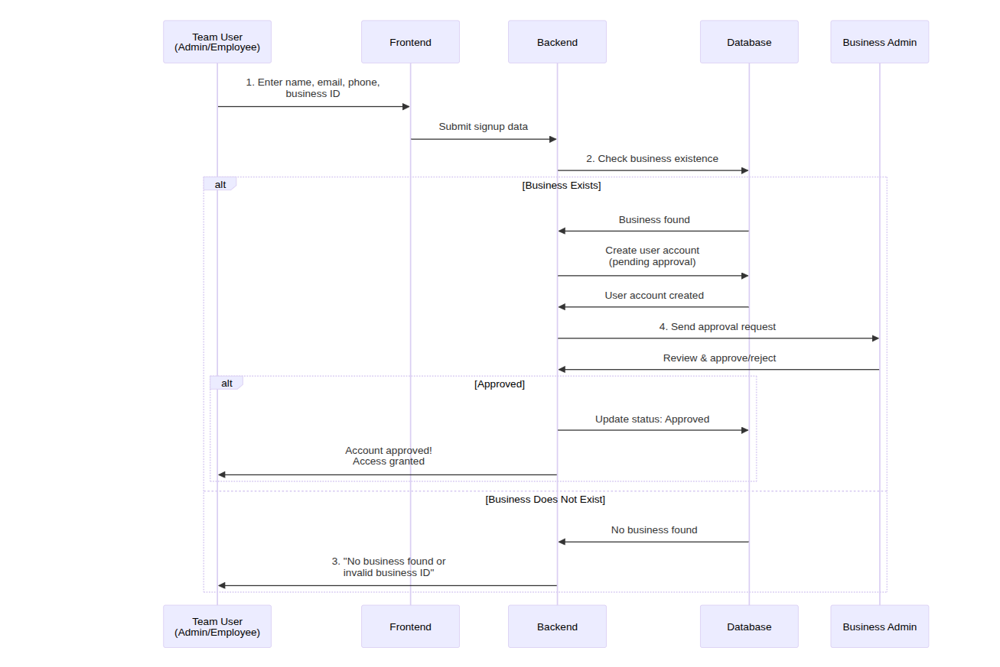
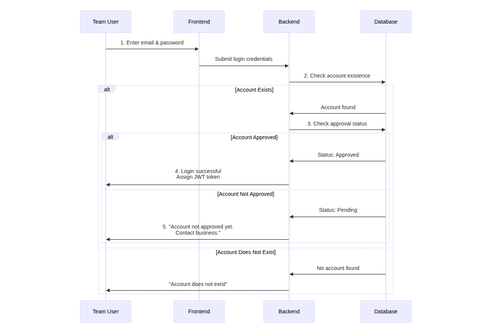
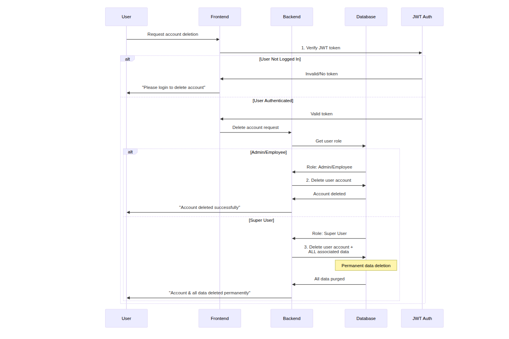
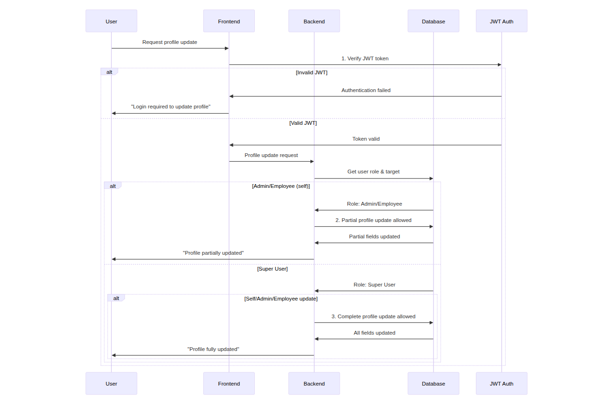

## Team API

### Register Super API

    /api/team/register/super
    Method: POST
    JWT: No
    body: {
        name: string,
        email: string,
        phone: string,
        gstin: string,
        business: string,
        address: {
            pincode: string,
            state: string,
            city: string,
            localAddress: string,
        },
        password: string,
    }

### Register Admin and Employee API

    /api/team/register/user
    Method: POST
    JWT: No
    body: {
        name: string,
        email: string,
        phone: string,
        type: enum("Admin", "Employee")
        businessId: string,
        password: string,
    }

### Login Team-User API

    /api/team/login
    Method: POST
    JWT: No
    body: {
        email: string,
        password: string,
    }

### Approve Team(Admin/Employee) API

    /api/team/approve/{teamUserId}
    Method: PATCH
    JWT: Yes -> Super and Admin

### Disapprove Team(Admin/Employee) API

    /api/team/disapprove/{teamUserId}
    Method: PATCH
    JWT: Yes -> Super and Admin

### Delete Team User API

    /api/team/delete/{teamUserId}
    Method: DELETE
    JWT: Yes -> Super, Admin and Employee

### Update Team User API

    /api/team/update/profile/{teamUserId}
    Method: PUT
    JWT: Yes -> Super, Admin and Employee
    body: {
        name: string,
        email: string,
        phone: string,
        gstin: string,
        business: string,
        address: {
            pincode: string,
            state: string,
            city: string,
            localAddress: string,
        },
    }

